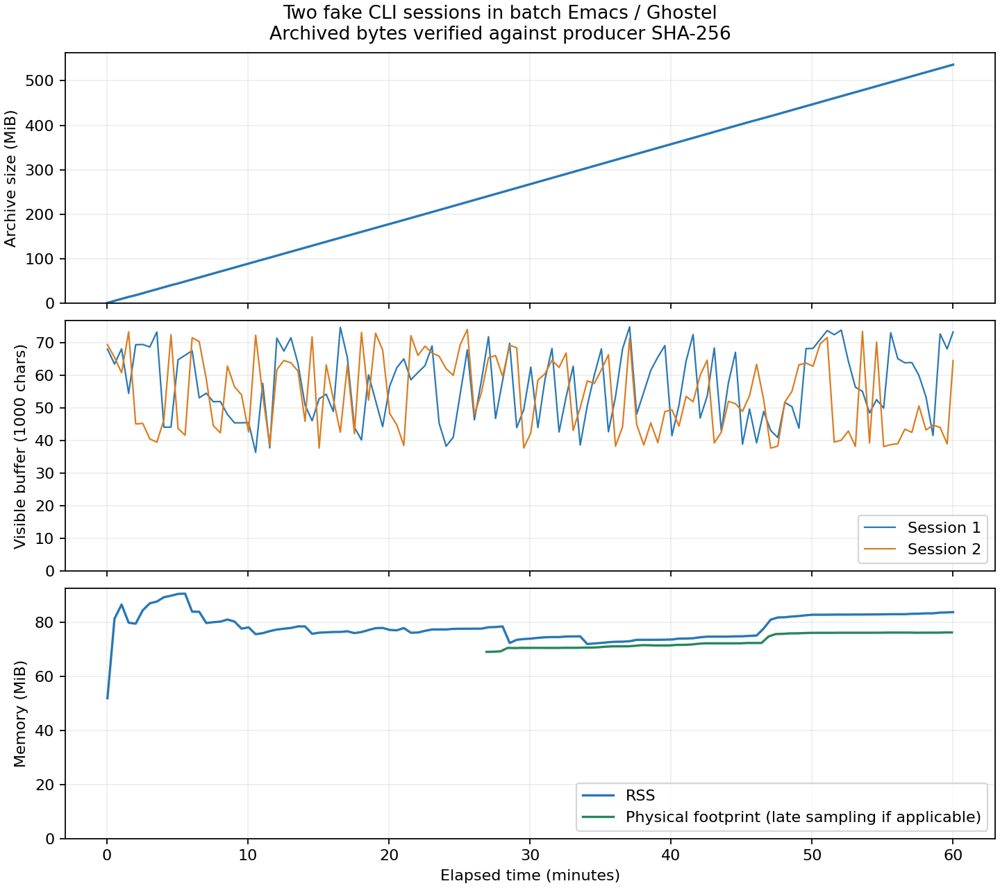

# 실제 PTY 가짜 출력 1시간 검증

2026-09-08. 실제 AI 대신 가짜 생성기 두 개를 Emacs 30.1/Ghostel PTY에서 3,600초 실행했다. 출력 보존·입력 수신·제한된 과거 페이지 검사는 통과했다. **GUI/IME 검사가 아니며, 전체 메모리 누수가 없다는 결론은 아니다.**



## 결과

| 항목 | 측정 결과 |
| --- | --- |
| 실행 시간 / 표본 | 3,600.065초 / 121개 |
| 세션 / 전체 원시 기록 | 2개 / 562,458,245바이트, 약 536.4 MiB |
| 기록 보존 | 두 파일 모두 생성기 SHA-256·바이트 수 일치. Ghostel 시작 화면 코드 7바이트씩 별도 확인 |
| 출력 버퍼 표본 최대 | 세션 0: 74,784문자 / 세션 1: 73,978문자 |
| 한글 입력 수신 | 세션별 120건, 총 240건 모두 확인 |
| 입력 수신 지연 | 세션 0: 중앙값 0.687 ms / 최대 20.013 ms; 세션 1: 중앙값 4.884 ms / 최대 26.527 ms |
| 과거 기록 조회 | 4,096문자 상한으로 16페이지 검사, 실제 최대 2,678문자 |
| undo | 모든 표본에서 출력 비활성 / 입력 활성 |
| Emacs RSS | 최초 51.9 MiB → 최종 83.7 MiB, 표본 최대 90.5 MiB |
| macOS physical footprint | 약 26.9분부터 59.9분까지 67개 표본, 69.0 → 76.2 MiB |

[집계 JSON](cli-validation-evidence/stream-1h/analysis.json), [시간별 표본](cli-validation-evidence/stream-1h/samples.json), [physical footprint](cli-validation-evidence/stream-1h/footprint.jsonl), [기록 페이지](cli-validation-evidence/stream-1h/history-pages.json).

출력은 한글·이모지·ANSI 색상과 긴 로그 줄을 포함한다. 입력은 주기적으로 초안 버퍼에서 보내고 가짜 CLI의 실제 수신 시각을 대조했다. 입력 지연은 키보드에서 화면에 나타나기까지의 지연이나 GUI 재표시 지연이 아니다.

## 메모리 해석과 한계

기록 파일은 계속 커졌고 표본의 출력 문자 수는 누적 증가하지 않았다. 다만 128 KiB는 Ghostel 엔진의 스크롤백 예산이며 일반 버퍼의 65,536문자 상한과 같지 않다. 표본 최대가 모든 순간의 문자 수에 대한 엄격한 상한도 아니다.

RSS만 보면 압축 메모리 등의 영향을 놓칠 수 있어 macOS `proc_pid_rusage`의 `ri_phys_footprint`를 추가 수집했다. Apple은 메모리 footprint를 설명할 때 dirty 메모리와 압축 메모리를 함께 다룬다. [Apple 메모리 진단 설명](https://developer.apple.com/videos/play/wwdc2021/10180/). 이 지표는 실행 중간부터 추가했으므로 초기 26.9분의 값은 없다.

후반 physical footprint가 약 7.2 MiB 증가했고 마지막 구간은 비교적 평탄했다. allocator가 보관하는 메모리, GC 시점, 측정용 표본 목록 등과 실제 잔존 객체를 분리한 프로파일은 아니다. 따라서 ‘무제한 출력 누적이 버퍼에 나타나지 않았다’와 ‘전체 프로세스 누수가 없다’를 같은 결론으로 합치지 않는다. 수시간·수일 사용의 메모리 보장도 아니다.

같은 호스트에서 다른 검증도 진행했다. 고립된 최대 처리량 측정이 아니며 동시 작업의 부하가 지연에 영향을 줄 수 있다. 실행 중인 Emacs는 시작 당시 코드를 사용했다. 그 사이 추가한 기록 열기 실패 정리와 메뉴 유지 수정은 별도 회귀 검사로 검증했고, 최신 코드의 짧은 출력 검사도 통과했다. 최신 코드 전체를 1시간 실행했다고 기록하지 않는다.

생성기와 배치 Emacs는 정상 종료했고 메모리 수집기도 대상 종료 후 끝났다. 원시 파일은 `var/terminal-*.ansi`에, 전체 실행 로그와 진단 자료는 `var/stream-soak-1h-20260908/`에 남겼다. 가짜 생성기만 사용한 이 시험의 실제 AI 호출은 0회다.

## 재현 개선

이번 1시간 실행은 `tests/terminal-stream-soak.el`을 직접 실행하고 중간에 메모리 수집기를 추가했다. 이후 재현을 쉽게 하려고 다음 실행 스크립트를 추가했다.

```sh
python3 tests/run-stream-soak.py var/새로운-1h-시험경로 --seconds 3600
MPLCONFIGDIR="$PWD/var/mpl-cache" python3 tests/plot-stream-soak.py \
  var/새로운-1h-시험경로 var/새로운-1h-시험경로/measurements.png
```

새 스크립트는 처음부터 소스·선택 가능한 컴파일 파일 해시, 실행 환경, Emacs PID와 physical footprint를 기록한다. 새 결과 폴더만 허용하고 기간은 5초부터 2시간까지 받는다. `--seconds 5`로 실행·기록 해시·입력·페이지·메모리 수집·종료 동작을 검사했다. 이 스크립트로 1시간을 다시 실행한 것은 아니다. 그림 생성에만 matplotlib이 필요하다.
